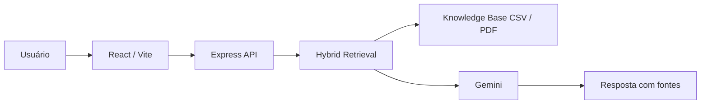
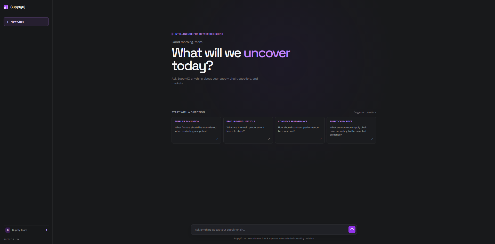
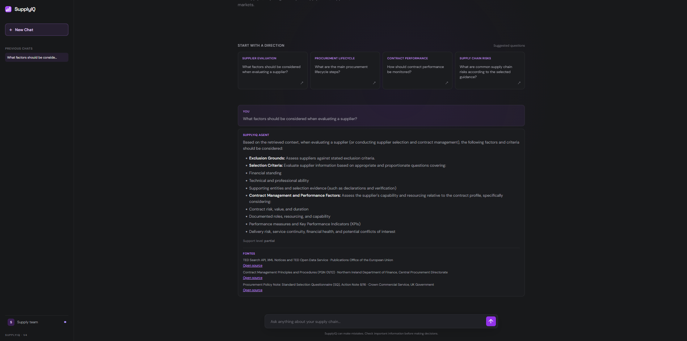
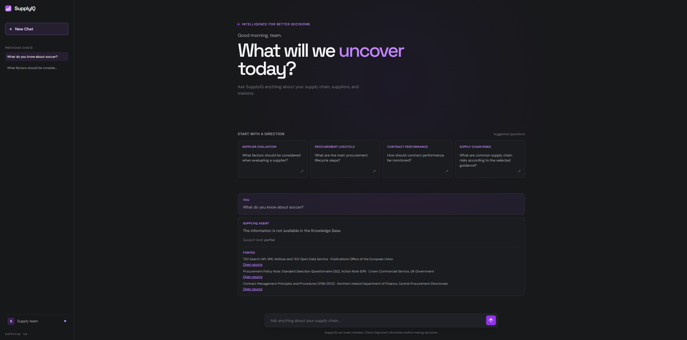
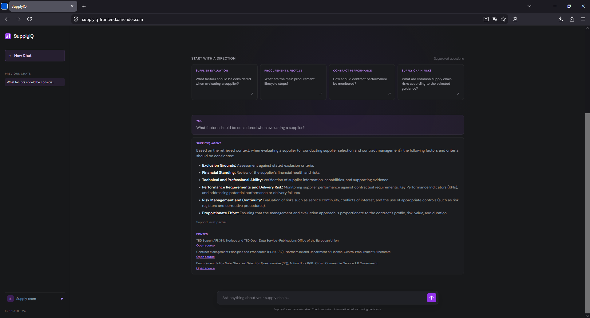

<div align="center">

# SupplyIQ

Assistente de procurement com RAG híbrido e Gemini.

[React](https://react.dev/) · [Vite](https://vite.dev/) · [TypeScript](https://www.typescriptlang.org/) · [Node.js](https://nodejs.org/) · [Express](https://expressjs.com/) · [Gemini API](https://ai.google.dev/) · [CSV](https://www.rfc-editor.org/rfc/rfc4180) · [PDF](https://www.adobe.com/acrobat/about-adobe-pdf.html) · [Render](https://render.com/)

</div>

## Visão geral

O SupplyIQ responde perguntas de procurement a partir de uma Knowledge Base local. Dados estruturados em CSV e conteúdo documental em PDFs normalizados são tratados como fontes distintas e recuperados de forma complementar.

O agente de IA é funcional e usa Gemini para redigir respostas fundamentadas exclusivamente no contexto recuperado. Quando não há contexto suficiente, o sistema informa que a informação não está disponível na Knowledge Base.

## Destaques

- Retrieval híbrido de registros estruturados e trechos documentais.
- Gemini com grounding no contexto recuperado.
- Fontes e limitações exibidas junto às respostas.
- Limitações de escopo preservadas e aplicadas no backend.
- Chat com histórico salvo localmente no navegador.
- Tratamento seguro de perguntas sem contexto recuperável.
- Chave da API mantida somente no ambiente do backend.

## Arquitetura



O usuário envia uma pergunta pelo frontend. A API recupera contexto estruturado e documental permitido, envia ao Gemini somente a pergunta e esse contexto e devolve uma resposta com as fontes e limitações aplicáveis.

## Tecnologias

| Tecnologia | Finalidade |
| --- | --- |
| React, Vite e TypeScript | Interface de chat web. |
| Node.js, Express e TypeScript | API HTTP, validação e orquestração do agente. |
| Gemini API | Geração de respostas fundamentadas. |
| CSV | Dados estruturados da Knowledge Base. |
| PDF | Conteúdo documental normalizado para retrieval. |
| Render | Plataforma prevista para o deploy em nuvem. |

## Estrutura do repositório

```text
frontend/        Aplicação React e Vite
backend/         API Express e agente Gemini
knowledge_base/  Dados e documentos controlados para retrieval
assets/          Evidências visuais do projeto
AGENTS.md        Regras de arquitetura, segurança e escopo
```

## Knowledge Base e agente

- Os CSVs permitidos ficam em `knowledge_base/processed/`.
- Os PDFs permitidos ficam em `knowledge_base/pdf/normalized/`.
- `raw/`, `validation/` e PDFs originais não são usados como contexto de resposta.
- `retrieveHybridContext` combina resultados estruturados e documentais para formar o contexto recuperado.
- O Gemini recebe somente a pergunta e o contexto recuperado; nunca recebe a chave de API, a base inteira ou dados fora do escopo permitido.

## Como executar localmente

Pré-requisitos: Node.js 24+ e uma chave da Gemini API.

Inicie o backend em um terminal:

```bash
cd backend
npm install
copy .env.example .env
```

No arquivo `backend/.env`, configure:

```env
PORT=3000
GEMINI_API_KEY=sua_chave_aqui
GEMINI_MODEL=gemini-3.5-flash-lite
```

Em seguida, execute:

```bash
npm start
```

Inicie o frontend em outro terminal:

```bash
cd frontend
npm install
npm run dev
```

- Frontend: [http://localhost:5173](http://localhost:5173)
- Health check: [http://localhost:3000/api/health](http://localhost:3000/api/health)

> No macOS ou Linux, use `cp .env.example .env` no lugar de `copy .env.example .env`.

## Exemplos de uso

**Pergunta suportada**

```text
What factors should be considered when evaluating a supplier?
```

Resposta esperada, de forma resumida: critérios de seleção e exclusão, situação financeira, capacidade técnica, risco e desempenho do fornecedor, sempre condicionados às fontes recuperadas.

**Pergunta fora do escopo**

```text
What do you know about soccer?
```

Resposta esperada: a informação não está disponível na Knowledge Base.

## Evidências visuais

### Tela inicial



### Resposta fundamentada



### Pergunta fora do escopo



## Segurança e limitações

- `.env` e a chave da API não são versionados.
- O Gemini pode ficar temporariamente indisponível por limite de uso ou cota.
- Dados em `raw/` e `validation/` não participam das respostas.
- Documentos históricos ou contextuais não constituem regra legal atual.
- O sistema não converte moedas nem infere totais ausentes.

## Deploy em nuvem

O SupplyIQ foi publicado no Render com dois serviços:

- Frontend: [https://supplyiq-frontend.onrender.com](https://supplyiq-frontend.onrender.com)
- Backend: [https://supplyiq-api-3qjw.onrender.com](https://supplyiq-api-3qjw.onrender.com)

O frontend está disponível publicamente e se comunica com o backend por meio da API REST. A aplicação foi testada em produção com uma pergunta real, retornando resposta do agente, fontes e nível de suporte.



## Histórico

O projeto possui commits incrementais no GitHub cobrindo estrutura, Knowledge Base, retrieval, agente, API, frontend e documentação.
